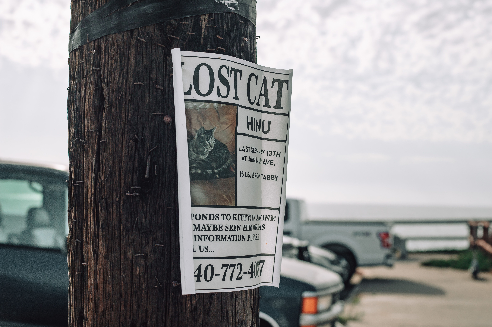

# Search for Lost Pets is a Developer's Institute hackathon project. 

### It has two goals : 
1. Fulfill Hackathon requirements
2. Create an application for searching lost pets using image recognition.

## Core functionallity:
1. For Pet Owners: Users upload photos of their missing pet and their description.
2. For Pet Finders: Individuals who spot a stray take a photo, which the app then scans against the "Lost" database to find a match by breed or pattern of pet's coat.

## Get it running:
1. clone the project
2. open in VSCode
3. open the file in the browser
